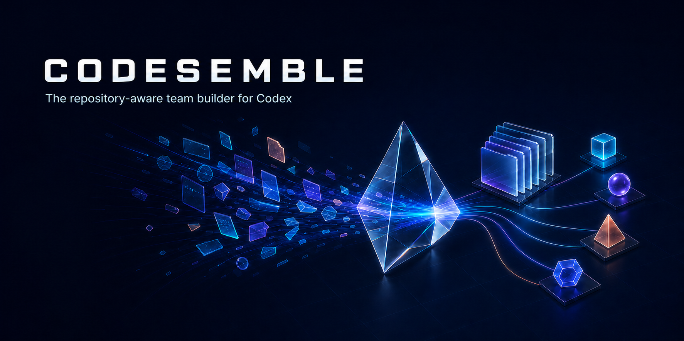

<p align="center">
  
</p>

<p align="center">
  <strong>Audit your repository. Assemble the smallest capable Codex team. Apply it safely.</strong>
</p>

<p align="center">
  <a href="#quick-start">Quick start</a> ·
  <a href="docs/USAGE.md">Usage</a> ·
  <a href="docs/ARCHITECTURE.md">How it works</a> ·
  <a href="docs/CONFIG_SAFETY.md">Safety</a> ·
  <a href="docs/ROLE_CATALOG.md">111-role catalog</a>
</p>

---

## What is Codesemble?

Codesemble is an open-source, repository-aware team builder for Codex.

It reads bounded project signals, asks what you are trying to accomplish, and
selects a small set of specialists from 111 role blueprints. It then compiles
that team into native, project-scoped Codex configuration you can review before
anything changes.

Codesemble configures Codex. It does not replace the Codex runtime.

## Who is it for?

Codesemble is for people working in real repositories who want specialized help
without installing a generic army of agents.

- **Solo builders** who want the right specialists without designing a team by hand.
- **Maintainers** who need reviewable, reversible project configuration.
- **Product teams** whose work spans engineering, testing, design, docs, growth, or operations.
- **Organizations** that want project-local defaults without silently changing personal Codex settings.

## How does it work?

```text
Repository evidence  →  Small team recommendation  →  Exact preview  →  Confirmed apply
```

1. **Audit** — reads bounded, typed project signals offline.
2. **Recommend** — proposes Lean, Balanced, and Full teams with reasons.
3. **Preview** — shows every agent, instruction, and configuration change.
4. **Apply** — writes only the exact plan you confirm, with doctor and rollback support.

[Read the complete workflow →](docs/USAGE.md)

## Why is it different?

Most agent packs start with a fixed roster. Codesemble starts with your work.

The 111 roles are a search space—not a team size. A typical project receives a
small, non-overlapping group whose responsibilities match the repository and the
goal. Installed roles and live concurrency stay separate, so 12 available roles
might still mean only 4 workers can run at once.

> **Evidence in. Native team out.**

[Explore the role catalog →](docs/ROLE_CATALOG.md)

[See the architecture →](docs/ARCHITECTURE.md)

## Quick start

### Install

```bash
codex plugin marketplace add VAMFI/codsemble --ref v0.1.0
codex plugin add codsemble@codsemble
```

Start a fresh Codex session so the plugin and project agents are reloaded.

### Build your team

```text
$initialize-team Set up a balanced Codex team for this workspace.
```

Codesemble audits and prepares a side-effect-free plan first. It applies project
files only after showing the exact diff and receiving the plan's confirmation ID.

### Keep it healthy

```text
$update-team Re-audit this workspace and preview team changes.
$team-doctor Check this project's generated team and configuration.
$rollback-team Preview rollback of the latest Codesemble transaction.
```

[Open the step-by-step guide →](docs/USAGE.md)

## What can it create?

```text
AGENTS.md                         bounded orchestration guidance
.codex/agents/<role>.toml         native specialist definitions
.codex/config.toml                optional project concurrency default
.codex/codsemble/manifest.json    ownership and selected-team record
.codex/codsemble/transactions/    reversible transaction history
```

Codesemble does not edit `~/.codex/config.toml`, mark a project trusted, collect
credentials, broaden permissions, or publish anything for you.

[Understand configuration safety →](docs/CONFIG_SAFETY.md)

[Read the privacy boundary →](docs/PRIVACY.md)

[Review the threat model →](docs/THREAT_MODEL.md)

## Documentation

| I want to… | Read… |
| --- | --- |
| Install, initialize, update, diagnose, or roll back | [Usage](docs/USAGE.md) |
| Understand the compiler and native Codex outputs | [Architecture](docs/ARCHITECTURE.md) |
| Review concurrency, no-clobber apply, and recovery behavior | [Configuration safety](docs/CONFIG_SAFETY.md) |
| Browse the 111 specialist blueprints | [Role catalog](docs/ROLE_CATALOG.md) |
| Understand local data handling | [Privacy](docs/PRIVACY.md) |
| Review trust boundaries and abuse cases | [Threat model](docs/THREAT_MODEL.md) |
| See what has actually been tested | [Validation evidence](docs/VALIDATION.md) |
| Understand the project promise and release gate | [Definition of Done](docs/DEFINITION_OF_DONE.md) |
| Reuse the visual identity correctly | [Brand guide](docs/BRAND.md) |

## Project status

Codesemble v0.1.0 is the initial public release. Structural and simulated checks
do not prove that every Codex version, policy, model, or operating system will
accept a generated team. Runtime claims are documented separately and tied to
the environment that produced them.

[See validation evidence →](docs/VALIDATION.md)

[View the roadmap →](ROADMAP.md)

## Contributing

Contributions are welcome. Start with the [contribution guide](CONTRIBUTING.md),
use [support guidance](SUPPORT.md) for reproducible questions, and report
vulnerabilities through the private process in [SECURITY.md](SECURITY.md).

Codesemble is an independent open-source project, licensed under
[Apache License 2.0](LICENSE).
